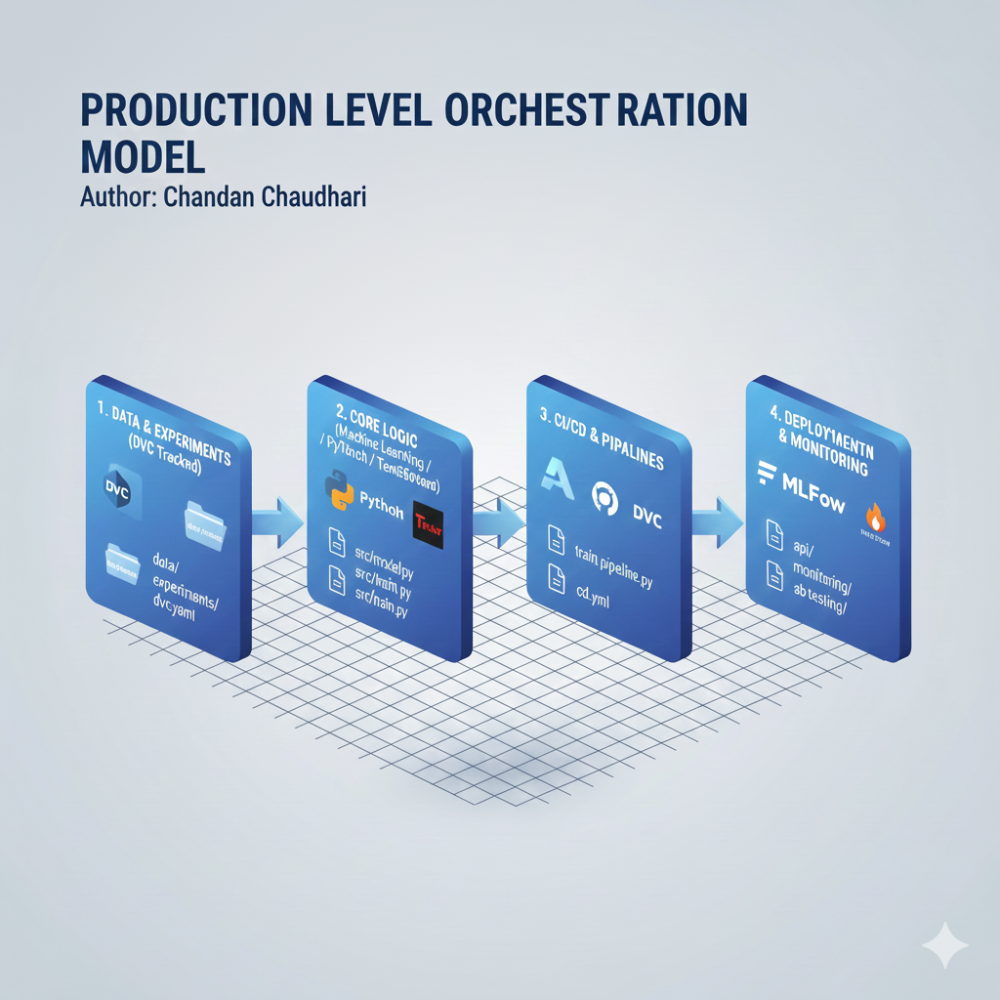

## Production Level Orchestration Model

**Author:** Chandan Chaudhari  

[](https://github.com/sponsors/chandanc5525)
[](https://scikit-learn.org/)
[](https://www.tensorflow.org/)
[](https://pytorch.org/)
[](https://fastapi.tiangolo.com/)
[](https://mlflow.org/)
[](https://dvc.org/)
---


## Project Overview

Version: 1.0.0

This repository contains a high-maturity MLOps framework designed for reproducible experimentation and scalable production deployment. It leverages DVC for data versioning, MLflow for experiment tracking, and FastAPI for real-time inference.

---

## Project Title: Heart Disease Prediction Model

## Objective: 

The primary objective of this project is to develop a machine learning model that can accurately predict the presence of heart disease in patients based on their clinical attributes. Early and reliable prediction can assist healthcare professionals in timely diagnosis and treatment, potentially reducing risks associated with cardiovascular diseases.

- Key goals include:

1. Identifying the most relevant features that contribute to heart disease.

2. Building predictive models with high accuracy, precision, and recall.

3. Providing a pipeline that can be used in a real-world clinical decision support system.

---

## Dataset Information: 

``` 

| Feature    | Description                                                       |
| ---------- | ----------------------------------------------------------------- |
| `age`      | Age of the patient in years                                       |
| `sex`      | Sex of the patient (1 = male, 0 = female)                         |
| `cp`       | Chest pain type (0-3, 4 types)                                    |
| `trestbps` | Resting blood pressure (mm Hg)                                    |
| `chol`     | Serum cholesterol in mg/dl                                        |
| `fbs`      | Fasting blood sugar > 120 mg/dl (1 = true, 0 = false)             |
| `restecg`  | Resting electrocardiographic results (0-2)                        |
| `thalach`  | Maximum heart rate achieved                                       |
| `exang`    | Exercise-induced angina (1 = yes, 0 = no)                         |
| `oldpeak`  | ST depression induced by exercise relative to rest                |
| `slope`    | Slope of the peak exercise ST segment (0-2)                       |
| `ca`       | Number of major vessels (0-3) colored by fluoroscopy              |
| `thal`     | Thalassemia (1 = normal, 2 = fixed defect, 3 = reversible defect) |
| `target`   | Presence of heart disease (1 = yes, 0 = no)                       |

```
---

## Analysis Report 

Report: HeartDisease_PredictionModel\analysis_report.txt

---

## Model Structure



---

## Glimpses of Deployment Model 


---